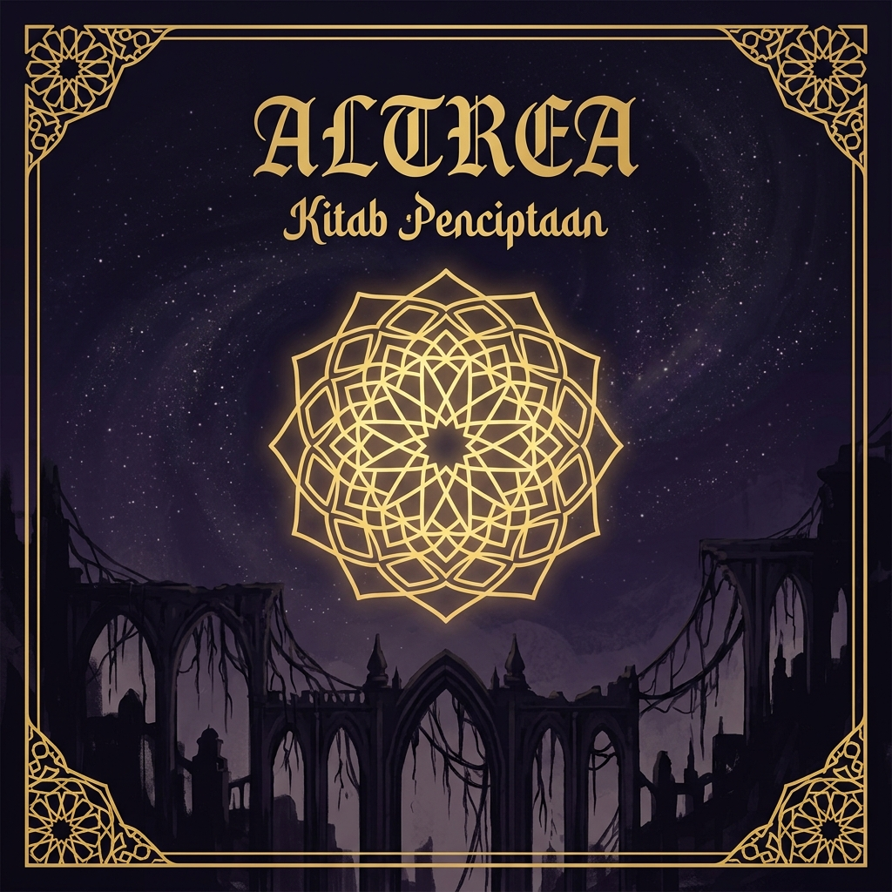

<div align="center">

  

  # 🌌 ALTREA — Kitab Penciptaan
  ### *Sebuah Web Novel Kosmologi Fantasy Interaktif*

  [](https://github.com/Ajizzhx)
  [](https://altrea-pied.vercel.app/)
  [](https://vitejs.dev/)
  [](https://developer.mozilla.org/en-US/docs/Web/JavaScript)
  [-00c853?style=for-the-badge)](#)

  <p align="center">
    <i>"Pada mulanya, Altrea bukan kegelapan. Kegelapan setidaknya memiliki kehadiran.<br>
    Altrea pada awalnya adalah ketiadaan yang sempurna — keheningan di antara dua nada yang belum pernah lahir."</i>
  </p>

  [🌐 Baca Online (Live Demo)](https://altrea-pied.vercel.app/) • [📚 Daftar Jilid](#-struktur-6-arc-cerita) • [📖 Glossarium Dunia](#-kosmologi--dunia-altrea) • [🚀 Penggunaan Lokal](#-panduan-pengembangan)

</div>

---

## 🌟 Tentang Altrea

**Altrea — Kitab Penciptaan** adalah karya web novel kosmologi fantasy epik ciptaan **ALSTRINE**. Web novel ini menghadirkan pengalaman membaca novel digital kelas atas berbasis web (*Progressive Web Novel App*) dengan visual **Dark Celestial Aesthetic**, animasi pendaran cahaya *stained glass*, sistem ornamen geometrik emas (*Gothic Arch & Islamic Mandala*), serta fitur baca interaktif yang responsif di desktop maupun perangkat seluler.

Seluruh **32 Jilid cerita** dapat dibaca secara utuh dengan berbagai pilihan preferensi mode tampilan dan ukuran font.

---

## ✨ Fitur-Fitur Utama

<table>
  <tr>
    <td width="50%">
      <h3>🏛️ Visual & Estetika Celestial</h3>
      <ul>
        <li><b>Dark Cathedral Theme</b>: Warna deep abyss <code>#1e202c</code>, pendaran emas <code>#c9a84c</code>, dan ungu <code>#60519b</code>.</li>
        <li><b>Particle & Light Rays System</b>: Debu bintang mengambang, <i>shooting stars</i>, dan pantulan berkas cahaya stained glass.</li>
        <li><b>Ornamen SVG Presisi</b>: Frame Gothic Arch, Lancip Frame, Mandala berputar, dan Corner Ornaments buatan sendiri tanpa library eksternal.</li>
        <li><b>Concept Art 2D</b>: Ilustrasi AI 2D Concept Art untuk latar Hero, Dunia, dan 6 Arc cerita.</li>
      </ul>
    </td>
    <td width="50%">
      <h3>📖 Mode Membaca Interaktif</h3>
      <ul>
        <li><b>4 Mode Membaca</b>: <i>Dark</i> (Gelap), <i>Void</i> (Hitam Pekat), <i>Purple</i> (Ungu Kosmik), dan <i>Sepia</i> (Klasik).</li>
        <li><b>4 Ukuran Font</b>: Kontrol instan ukuran teks (S, M, L, XL).</li>
        <li><b>Progress Tracker & Bookmark</b>: Menyimpan status pembacaan dan penanda halaman otomatis di <code>localStorage</code>.</li>
        <li><b>Floating Controls & Mobile FAB</b>: Toolbar mengambang di desktop, dan Floating Action Button (FAB) + Glassmorphism Dropdown Sheet di HP.</li>
      </ul>
    </td>
  </tr>
  <tr>
    <td width="50%">
      <h3>📚 Management 32 Jilid</h3>
      <ul>
        <li><b>Katalog Jilid Lengkap</b>: Grid 32 Jilid dengan indikator waktu baca, excerpt, dan badge status <i>Selesai / Ditandai</i>.</li>
        <li><b>Sticky Filter Arc</b>: Filter interaktif untuk melihat jilid berdasarkan 6 Arc cerita.</li>
        <li><b>Global Progress Bar</b>: Indikator persentase penyelesaian pembacaan novel.</li>
        <li><b>Navigasi Mulus</b>: Tombol Prev/Next jilid dengan scroll otomatis ke atas.</li>
      </ul>
    </td>
    <td width="50%">
      <h3>📖 Glossarium Dunia Realtime</h3>
      <ul>
        <li><b>Instant Search</b>: Pencarian <i>realtime</i> nama ras, lokasi, karakter, konsep, dan bahasa Altrea.</li>
        <li><b>Kategori Interaktif</b>: Filter kategori <i>Ras, Lokasi, Konsep, Karakter, Empat Napas, dan Bahasa</i>.</li>
        <li><b>Tag Relasi Entri</b>: Klik tag relasi untuk melakukan pencarian instan antar entri.</li>
        <li><b>Rujukan Jilid</b>: Tautan langsung ke jilid terkait dari setiap entri glossarium.</li>
      </ul>
    </td>
  </tr>
</table>

---

## 📜 Struktur 6 Arc Cerita

| Arc | Judul Utama | Judul Bahasa Altrea | Makna Altrea | Cakupan |
| :---: | :--- | :--- | :--- | :---: |
| **Arc I** | Kelahiran Dunia | *Resonansi Pertama* | Getaran pertama yang melahirkan segalanya | **Jilid 1 – 4** |
| **Arc II** | Anak-Anak Celah | *Sylvaren* | Yang lahir dari jeda antara hal-hal | **Jilid 5 – 9** |
| **Arc III** | Yang Tidur | *Aeruun* | Yang ada sejak sebelum ada kategori | **Jilid 10 – 18** |
| **Arc IV** | Musim Perang | *Ignar Vaelith* | Api yang tidak tahu cara padam | **Jilid 19 – 23** |
| **Arc V** | Kelahiran Baru | *Vaerith* | Berada di dua tempat sekaligus dan utuh di keduanya | **Jilid 24 – 27** |
| **Arc VI** | Yang Kelima | *Naevh* | Berdiri di ketinggian dan melihat ke bawah tanpa takut | **Jilid 28 – 32** |

---

## 🌌 Kosmologi & Dunia Altrea

<details>
<summary><b>🔹 Enam Ras Altrea (Klik untuk membuka)</b></summary>

1. **Auren** (*Auren*) — Bangkit dari bekas telapak tangan Duraen. Perawakan teguh, berotot padat, kulit tanah liat kemerahan, dan mata dua warna. Mewariskan kebijaksanaan melalui tulang.
2. **Sylvaren** (*Sylvaren*) — Lahir dari celah di antara empat napas dan mimpi pertama. Memiliki mata cermin yang memantulkan kebenaran jiwa dan menguasai *Resonansi Celah*.
3. **Vraen** (*Vraen*) — Lahir dari ledakan cahaya oranye Ignar. Bertubuh nyala membara, kreatif secara obsesif, dan tidak bisa berdiam diri.
4. **Vauren** (*Vauren*) — Ras campuran Auren dan Sylvaren yang mendiami pesisir dan dataran rendah.
5. **Thael** (*Thael*) — Penjaga pesisir Samudra Thessarne yang bertindak sebagai penghubung arus laut dan daratan.
6. **Naevh** (*Naevh*) — Ras bercahaya perak yang turun dari langit malam pada era akhir.
</details>

<details>
<summary><b>🔹 Empat Napas Dunia (Klik untuk membuka)</b></summary>

- 🔥 **Ignar** — Napas yang panas, yang mendorong, yang membakar. Keinginan untuk ada.
- 💧 **Vael** — Napas yang dingin, yang menarik, yang menyimpan. Memori dan rindu yang tak bertepi.
- 🍃 **Solmae** — Napas yang luas, yang berputar. Kebebasan sejati dan rahasia takdir.
- ⛰️ **Duraen** — Napas yang berat, yang diam, yang menopang. Kesabaran abadi dan fondasi segalanya.
</details>

---

## 🛠️ Stack Teknologi & Arsitektur

```bash
Altrea/
├── novel/
│   └── Altrea - Kitab Penciptaan.md     # Source text utuh 32 jilid novel
├── web-novel/
│   ├── public/                           # Asset statis, favicon & concept art
│   │   ├── hero-bg.jpg
│   │   ├── world-bg.jpg
│   │   ├── og-image.jpg
│   │   └── images/                       # Ilustrasi Arc I–VI
│   ├── src/
│   │   ├── components/                   # Component modular (Navbar, Footer, SVG Ornaments)
│   │   ├── content/                      # chapters-full.json (Teks utuh 32 jilid)
│   │   ├── data/                         # arcs.json, chapters.json, glossary.json
│   │   ├── pages/                        # Landing, Chapters, Reader, Glossary
│   │   ├── styles/                       # CSS Tokens & Module Stylesheets
│   │   └── utils/                        # LocalStorage Manager & Custom Markdown Parser
│   ├── index.html                        # Base HTML shell with SEO OpenGraph tags
│   ├── parse-novel.js                    # Node.js script otomatis pengurai novel markdown
│   └── package.json
```

- **Core Framework**: Vite 5 + Vanilla JavaScript (ES2022)
- **Styling Architecture**: Vanilla CSS Custom Properties (Design Tokens System)
- **Markdown Processing**: Marked.js + Custom Altrea Typography Parser (*Drop Cap, Pull Quotes, Ornamental Dividers*)
- **State & Storage**: Browser `localStorage` Wrapper

---

## 🚀 Panduan Pengembangan Lokal

```bash
# Clone repository
git clone https://github.com/Ajizzhx/Altrea.git
cd Altrea/web-novel

# Install dependencies
npm install

# Jalankan dev server
npm run dev
```

---

<div align="center">

  <p>Dibuat dengan kesempurnaan puitis & rasa hormat untuk dunia <b>Altrea</b>.</p>
  <p><b>Altrea: Kitab Penciptaan © 2026 ALSTRINE</b></p>

</div>
